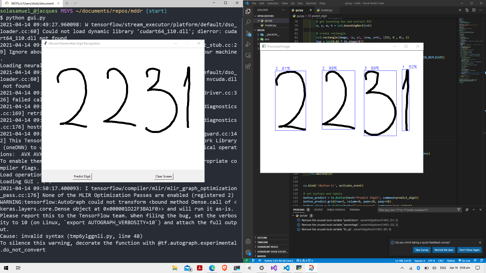

# Mouse Drawn/Handwritten Digit Recognition


## Table of contents
* [General info](#general-info)
* [Technologies](#technologies)
* [Lauch](#launch)

## General info
This project trains a convolutional neural network on the mnnist dataset and predicts digit drawn onto its canvas. Python's Tkinter library was used for the GUI.
	
## Technologies
Project is created with:
* Keras: 2.4.3
* matplotlib: 3.4.1
* numpy: 1.19.5
* opencv-python: 4.5.1.48
* pandas: 1.2.4
* tensorflow: 2.5.0rc1
	
## Launch
To run this project, run the following commands in a terminal:

```
$ cd ../mddr
$ python -m venv env
$ source env/Scripts/activate
$ python -m pip install -U pip
$ python -m pip install numpy pandas matplotlib opencv-python keras tensorflow
$ python model.py
$ python gui.py
```

Note: Draw a set of digits and click on the "Predict digit" button. Close the Procesed Image Window before attempting to draw another set of digits.
